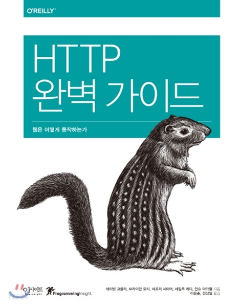
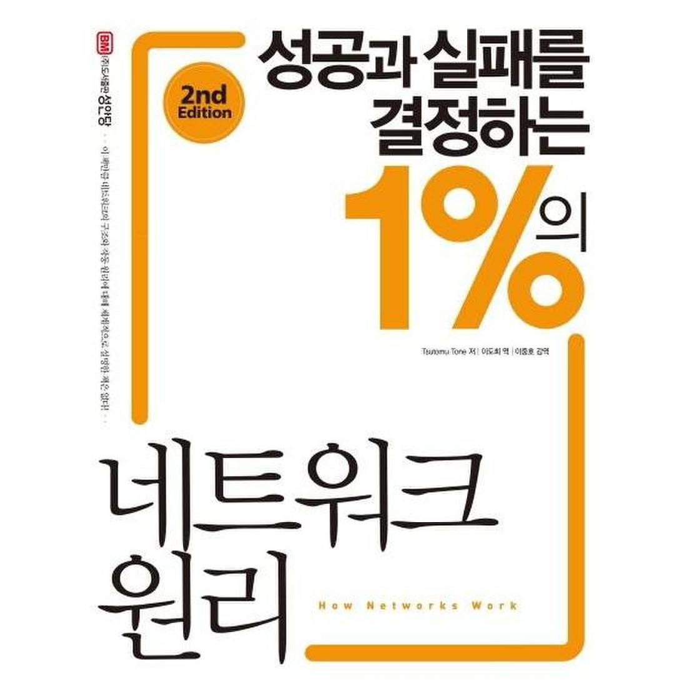
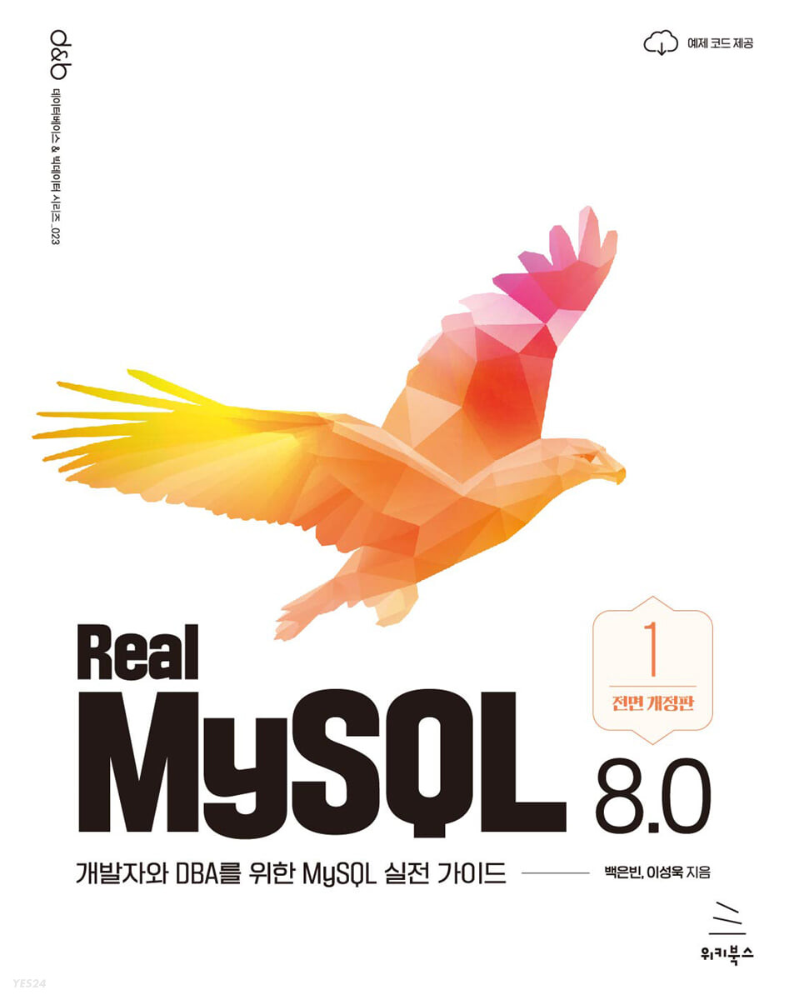
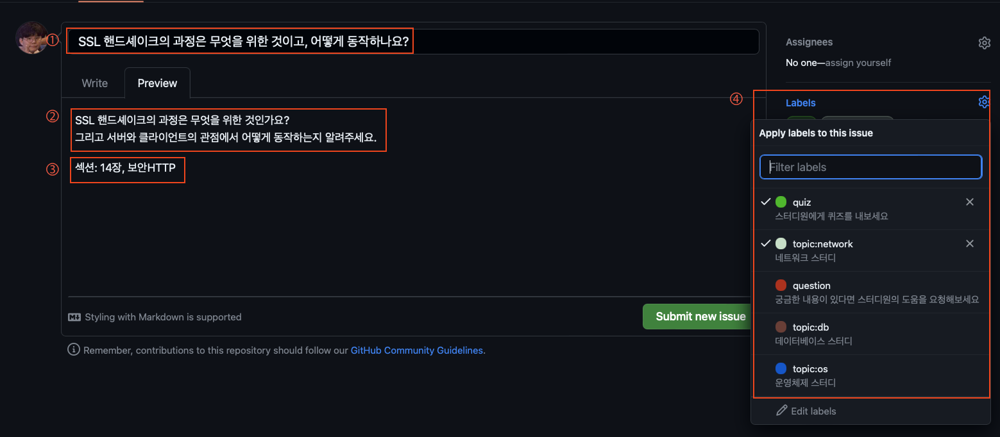

# 기술 독서 스터디

기술 서적을 읽고 토론하며 컴퓨터 과학을 학습하는 공간

| HTTP                                                      | 네트워크                                                    | 데이터베이스                                                     |
|-----------------------------------------------------------|---------------------------------------------------------|------------------------------------------------------------|
|  |  |  |

 

## 참여 인원

- [korjun1993](https://github.com/korjun1993)
- [hoa0217](https://github.com/hoa0217)
- [sedin2](https://github.com/sedin2)
- [dev-redo](https://github.com/dev-redo)
- [D7S5](https://github.com/D7S5)
- [aorri2](https://github.com/aorri2)

 

## 진행 방식

- [진행 방식 - HTTP 완벽 가이드](https://github.com/korjun1993/cs-book-study/wiki/HTTP-%EC%99%84%EB%B2%BD%EA%B0%80%EC%9D%B4%EB%93%9C-%EC%8A%A4%ED%84%B0%EB%94%94)
- [진행 방식 - 성공과 실패를 결정하는 1%의 네트워크 원리](https://github.com/korjun1993/cs-book-study/wiki/%EC%84%B1%EA%B3%B5%EA%B3%BC-%EC%8B%A4%ED%8C%A8%EB%A5%BC-%EA%B2%B0%EC%A0%95%ED%95%98%EB%8A%94-1%25%EC%9D%98-%EB%84%A4%ED%8A%B8%EC%9B%8C%ED%81%AC-%EC%9B%90%EB%A6%AC)

 

## 규칙

- 퀴즈 외에 질문, 심화내용, 공유하고 싶은 내용 등은 개수에 제한 없이 자유롭게 이슈를 활용하기
- 모이는 날 전까지 생성된 이슈는 모두 숙지하기

 

## 이슈 생성 양식

### 제목

- 대략적인 제목을 적어주세요

### 내용

- 광범위한 내용보다는 좁은 주제로 자세히 적어주세요

### 출처

- 퀴즈라면 책의 어디 부분에 해당하는지 기입해주세요.
- 정보공유라면 책의 어디 부분에서 확장한 내용인지 기입해주세요.

### 라벨

- 이슈 유형 (quiz/question/tip), 주제(network/os/db)를 선택해주세요
    - `quiz` - 중요하다고 생각하는 개념을 퀴즈로 만들어보세요.
    - `question` - 이해되지 않는 내용이 있다면, 스터디원의 도움을 요청해보세요.
    - `tip` - 심화된 내용을 조사했다면, 스터디원에게 공유해보세요.
